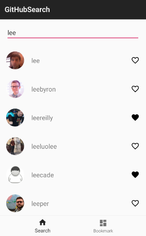
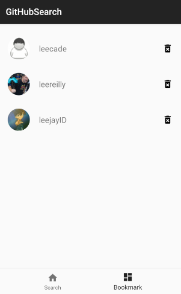

# GitHub User Search Sample
This is just a simple project for user searching and bookmarking on gitHub.

## Introduction
### Feature
This sample contains two screeen : 
 1. searching user from network
 2. user bookmark

  
  

 
### Libraries  
 * Jetpack
   - ViewModel
   - Room
   - Paging
 * RxAndroid
 * Glide
 * Retrofit
 
 
 
 
